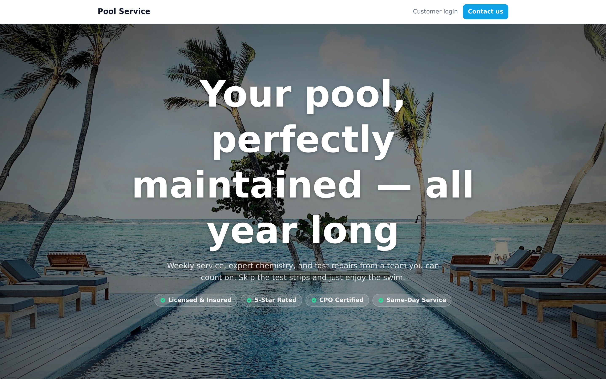
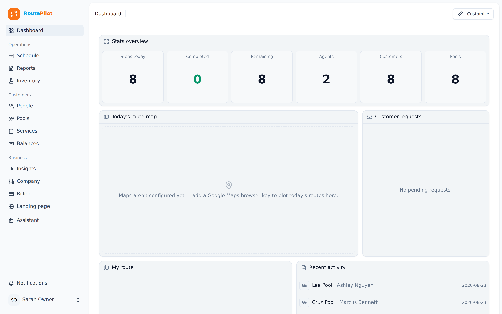
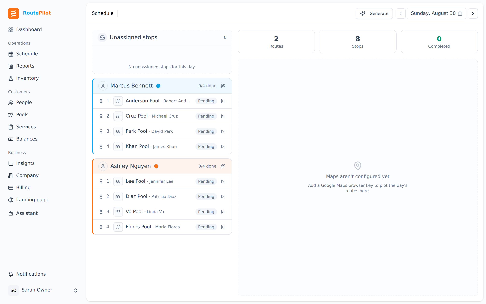
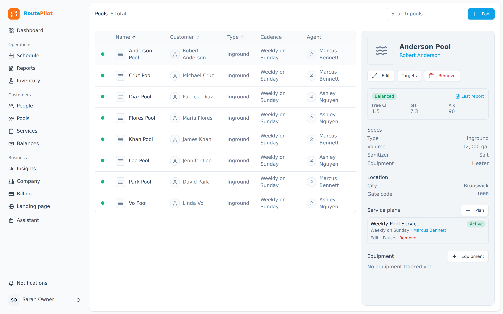
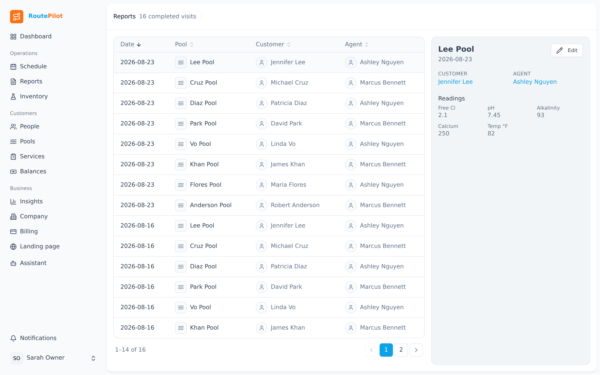
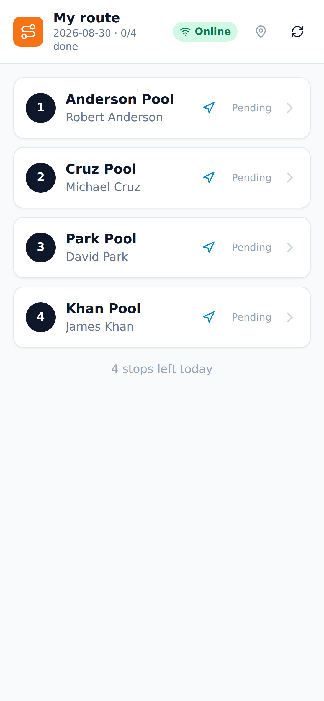
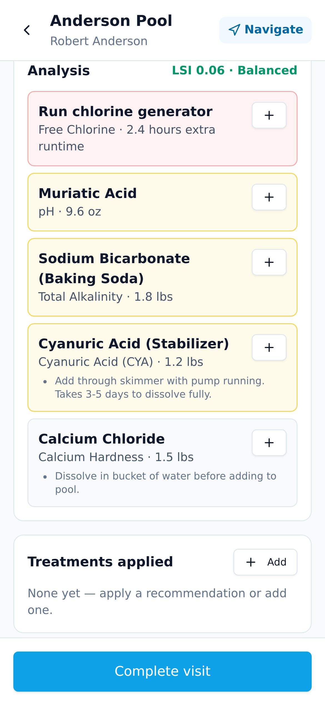
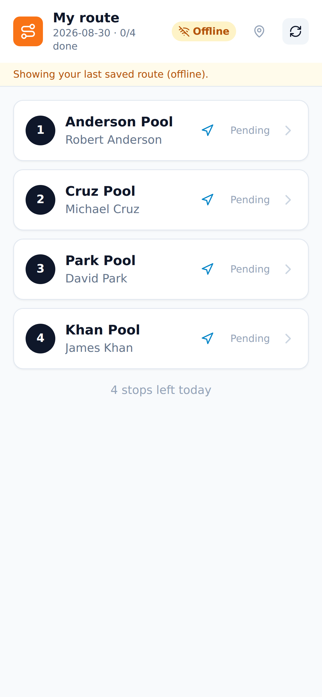
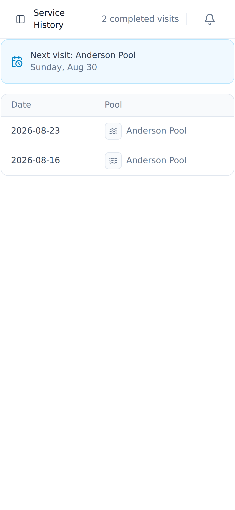
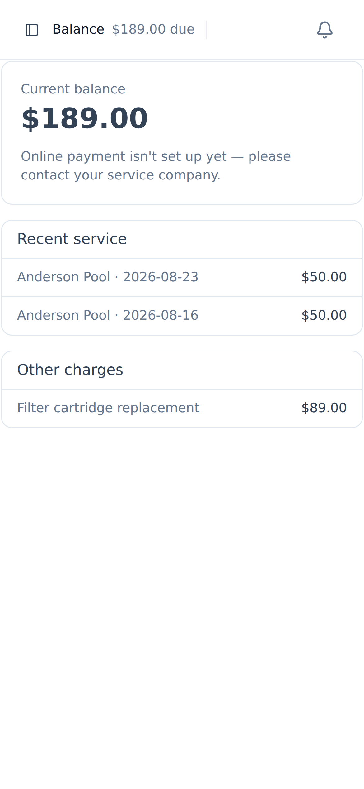

# RoutePilot

**All-in-one pool service management software.** Route optimization, AI-assisted chemistry
tracking, automated billing, an offline field app for technicians, and a branded customer website
+ portal — for pool cleaning businesses that have outgrown spreadsheets and text threads.

[](https://github.com/rocketskatesninja/routepilot.pro/actions/workflows/tests.yml)
[](https://github.com/rocketskatesninja/routepilot.pro/actions/workflows/lint.yml)
[](LICENSE)

Built with **Laravel 12 · Inertia v2 · Vue 3 (TypeScript) · Tailwind**.



## What it does

- **Your own branded customer website + portal** — homeowners see pool health, service history,
  and their next visit; fewer "when are you coming?" calls.
- **AI chemistry that thinks for your techs** — reads 12-visit trends and the 7-day forecast and
  tells the tech exactly what to add, on-device, even offline.
- **Smart routing + live operations** — pack more stops into fewer miles, then watch the day
  unfold live: pending, in-progress, and completed stops across every truck on one map.
- **A field app that works offline** — on-device chemistry dosing and photo capture, no signal
  required at the pool.

## Screenshots

Three surfaces, one tenant — all from the seeded demo tenant ("Demo Company"), no real customer
data. The full tour (every back-office page in light + dark, the complete field-app flow, and
every customer portal page — 36 screens in all) lives in
[`public/assets/images/screenshots/tour/`](public/assets/images/screenshots/tour/).

**Back office** (tenant admin)

| Dashboard | Route map |
|---|---|
|  |  |

| Pools (master-detail) | Reports |
|---|---|
|  |  |

<sub>Dark "ops" theme: [dashboard](public/assets/images/screenshots/tour/tenant/dark/dashboard.png) ·
[schedule](public/assets/images/screenshots/tour/tenant/dark/schedule.png) ·
[pools](public/assets/images/screenshots/tour/tenant/dark/pools.png)</sub>

**Agent field app** (offline-resilient PWA)

  

The middle screen is the on-device AI chemistry engine: a water test produces real dosing
recommendations — computed offline, no round trip to a server.

**Customer portal**

 

The public landing page (hero image above) is the fourth surface — same tenant, same data,
rendered SSR with per-tenant branding.

## Feature grid

| | | |
|---|---|---|
| **Live route status** — real-time per-stop badges and live map colors across every agent | **Automated billing & autopay** — invoices, receipts, and card-on-file autopay run themselves | **Inventory management** — chemical usage auto-deducts from every service visit |
| **Professional service reports** — photo + chemistry reports emailed after every visit | **Build-your-own dashboard** — drag-to-reorder widgets for stops, map, weather, and billing | **AI assistant** — ask about a customer, a route, or pool chemistry in plain English |
| **Drag-to-reassign** — move a stop to another tech and every future visit follows | **Customer management** — a pool company CRM built in: pools, contacts, notes, history | |

## Architecture

Four surfaces, one codebase:

1. **Back-office** (tenant admin) — dark "ops" theme, customizable dashboards.
2. **Agent field PWA** — daylight theme, offline-resilient, installable.
3. **Customer portal** — lightweight, online-only.
4. **Public landing** — SSR, section-based page builder, per-tenant branding.

- **Multi-tenant:** shared schema + `tenant_id` scoping (`BelongsToTenant` concern +
  `TenantScope`); tenant resolved from session (staff) or custom domain/subdomain (public).
- **Conventions:** thin controllers → Form Requests → single-purpose Action classes; Eloquent
  relationships and query scopes over raw SQL; `declare(strict_types=1)` everywhere.
- **Security:** privilege/identity fields (`role`, `tenant_id`, `is_active`) are never
  mass-assignable — set only via `forceFill()` at controlled call sites; Google OAuth requires a
  verified email and a linked `google_id`, never an email-match login; secrets are `encrypted` at
  rest; policies/gates on every sensitive action with audit logging on billing, permissions,
  deletes, and impersonation.
- **Theming:** CSS-variable design tokens (`resources/css/app.css`), daylight + dark "ops" themes,
  per-tenant brand color overlay at runtime.

See `CLAUDE.md` for the full engineering charter.

## Quality gates

```bash
./vendor/bin/pest                 # tests
./vendor/bin/pint --test          # PHP code style (PSR-12 via Pint)
./vendor/bin/phpstan analyse      # static analysis (Larastan, level 6)
npm run lint && npm run format:check
```

CI runs Pest tests, Larastan (PHPStan level 6) static analysis, Pint style checks,
ESLint/Prettier, and `composer audit` / `npm audit` security scans on every push and PR.

## Local setup

```bash
composer install
npm install
cp .env.example .env
php artisan key:generate
php artisan migrate
php artisan db:seed --class=DemoSeeder   # optional: seeds a demo tenant + sample data
npm run dev        # or: npm run build
php artisan serve
```

By default the app uses SQLite (`database/database.sqlite`); configure MySQL in `.env` for a
production-like setup.

The `DemoSeeder` creates a "Demo Company" tenant with one login per role, all password `password`:

| Role | Email |
|---|---|
| Super admin (platform) | `admin@routepilot.pro` |
| Tenant admin | `tenant@routepilot.pro` |
| Agent (field app) | `agent@routepilot.pro` |
| Customer (portal) | `customer@routepilot.pro` |

## License

Source-available for portfolio and review purposes — see [LICENSE](LICENSE). Not open source; no
reuse or redistribution rights are granted.
